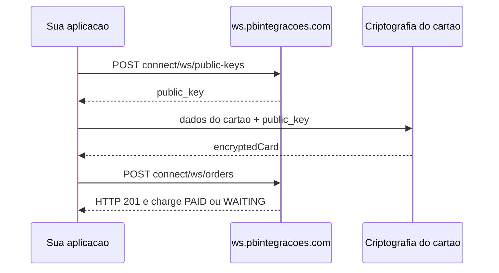

# Pedido com cartão de crédito

O número do cartão **nunca** é enviado em texto claro no `POST connect/ws/orders`. O campo `charges[].payment_method.card.encrypted` deve conter um token gerado com a chave pública obtida em `POST connect/ws/public-keys`.

## Fluxo resumido



## Passo 1 — Chave pública

```
POST connect/ws/public-keys
```

Body: [examples/requests/public-keys.json](../examples/requests/public-keys.json)

A resposta traz `public_key` (RSA) usada na criptografia do cartão.

## Passo 2 — Criptografar o cartão

Há dois caminhos válidos. Escolha conforme o tipo de aplicação e requisitos de **PCI DSS**.

### Opção A — Browser (recomendado para web e produção)

É o fluxo documentado pelo PagBank: carregar o SDK JavaScript oficial no **browser** (ou WebView) e chamar `PagSeguro.encryptCard`.

SDK:

```
https://assets.pagseguro.com.br/checkout-sdk-js/rc/dist/browser/pagseguro.min.js
```

Exemplo conceitual:

```javascript
const card = PagSeguro.encryptCard({
  publicKey: 'SUA_PUBLIC_KEY',
  holder: 'NOME NO CARTAO',
  number: '4111111111111111',
  expMonth: '12',
  expYear: '2030',
  securityCode: '123'
});
// card.encryptedCard → usar no pedido
```

**PCI e apps desktop/mobile:** quando o usuário digita o cartão na sua aplicação, o caminho com **menor exposição** costuma ser:

- **WebView** (ou componente equivalente) carregando uma página **sua** que importa o SDK PagBank e devolve apenas o `encryptedCard` ao app nativo; ou
- **iframe** / checkout hospedado, de forma que PAN e CVV **não** transitem pelo código C#/Java/Python do app principal.

Assim o app desktop/mobile só recebe o token já criptografado, sem manipular número de cartão em texto claro no processo principal.

Ver também [examples/code/order-credit-card/encrypt-card.browser.mjs](../examples/code/order-credit-card/encrypt-card.browser.mjs).

### Opção B — Servidor, automação ou desktop (sem browser)

Usado quando não há browser disponível (ex.: n8n, scripts Node, alguns apps desktop). A PagBank Integrações valida na prática o **mesmo formato de token** que o SDK do browser gera, via criptografia **RSA PKCS#1** sobre uma string com número, CVV, validade, portador e timestamp, usando a `public_key` do passo 1.

**Implementação de referência (open source):** o node n8n PagBank Connect mantém uma solução testada em produção que não depende de carregar o `pagseguro.min.js` no browser:

| Item | Local |
|------|--------|
| Repositório | [github.com/r-martins/PagBank-n8n](https://github.com/r-martins/PagBank-n8n) |
| Lógica de criptografia | [`lib/pagbank/pagseguro-n8n-compatible.js`](https://github.com/r-martins/PagBank-n8n/blob/master/lib/pagbank/pagseguro-n8n-compatible.js) (função `encryptCard`) |
| Wrapper TypeScript (n8n) | [`lib/pagbank/PagBankEncryption.ts`](https://github.com/r-martins/PagBank-n8n/blob/master/lib/pagbank/PagBankEncryption.ts) |
| Uso no fluxo de pedido | [`nodes/PagBank/PagBankSimple.node.ts`](https://github.com/r-martins/PagBank-n8n/blob/master/nodes/PagBank/PagBankSimple.node.ts) (`getEncryptionPublicKey` → `encryptCardData` → `POST connect/ws/orders`) |

Esse pacote foi adaptado às restrições do n8n Community Nodes (sem dependências npm extras do SDK oficial). Para **C#, Java, Python ou outro runtime**, use o repositório acima como **especificação de comportamento** e reimplemente o contrato (RSA + formato da string), ou invoque um subprocesso Node que reutilize o mesmo módulo — sempre validando em **sandbox** que o PagBank aceita o `encrypted` gerado.

**Atenção:** este caminho não substitui assessoria PCI. Se o PAN/CVV passam pelo seu processo servidor ou desktop, você pode estar no escopo de compliance de dados de cartão. Para apps de face ao consumidor, sempre use a **Opção A** (WebView + SDK ou iframe).

Resumo do contrato (sem código — detalhes no repo n8n):

1. Normalizar `holder` (sem dígitos, limite de caracteres, sem acentos).
2. Montar string: `numero;cvv;mes;ano;portador;timestamp`.
3. Criptografar com a `public_key` (PEM) usando **RSA PKCS#1 v1.5**.
4. Enviar resultado em **Base64** em `card.encrypted`.

Documentação complementar: [examples/encryption/README.md](../examples/encryption/README.md).

**Não** envie PAN, CVV ou validade em claro no JSON do pedido.

## Passo 3 — Criar pedido

```
POST connect/ws/orders
```

Body: [examples/requests/order-credit-card.json](../examples/requests/order-credit-card.json) — substitua `encrypted` pelo token do passo 2.

Campos obrigatórios em `charges[0].payment_method`:

- `type`: `CREDIT_CARD`
- `installments`: número de parcelas
- `capture`: `true` para captura automática
- `card.encrypted`: token criptografado

## Resposta HTTP

`POST connect/ws/orders` retorna **201 Created** quando o pedido é criado — isso é **sucesso**, não erro. Ver [08-errors.md](08-errors.md).

## Resposta do pedido

Verifique `charges[0].status` (`PAID`, `DECLINED`, `WAITING`) e `payment_response` para códigos de autorização.

## Fora do MVP

- **3D Secure:** `POST connect/ws-sdk/checkout-sdk/sessions` — fase futura

## Documentação oficial

[PagBank — Criar pedido](https://developer.pagbank.com.br/reference/criar-pedido)

## Exemplos de código

- [examples/code/order-credit-card/](../examples/code/order-credit-card/) — curl e Node para o pedido após obter `encrypted`
- [examples/encryption/README.md](../examples/encryption/README.md) — referência server-side e PCI
