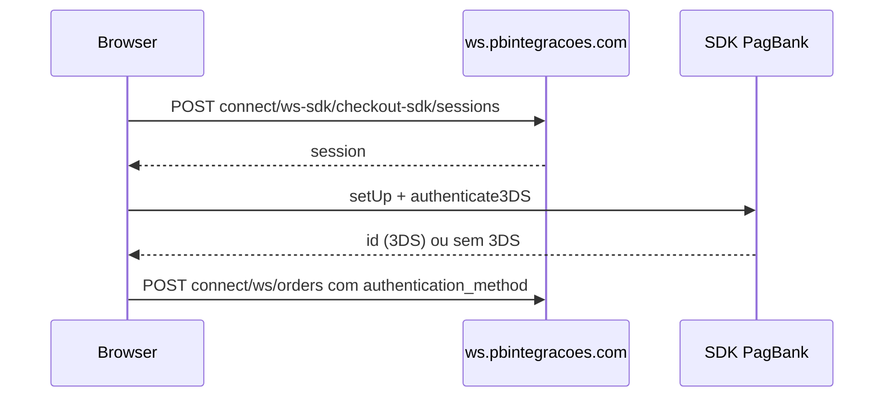

# 3D Secure (3DS)

Autenticação **3DS** para cartão reduz chargeback e é exigida em muitos cenários. O fluxo é **browser-first**: sessão via API + desafio com SDK PagBank + `authentication_method` no pedido.

## Visão geral



## Passo 1 — Sessão 3DS

```
POST connect/ws-sdk/checkout-sdk/sessions
```

Body vazio `{}` ou conforme SDK. Resposta típica:

```json
{ "session": "..." }
```

Base: `https://ws.pbintegracoes.com/pspro/v7/` — mesma autenticação dos demais endpoints Connect (`PAGBANK_CONNECT_KEY`). Ver [03-headers.md](03-headers.md) e [09-security-credentials.md](09-security-credentials.md).

Snippets: [examples/code/3ds/](../examples/code/3ds/).

## Passo 2 — Autenticar no browser

Carregue o SDK:

```
https://assets.pagseguro.com.br/checkout-sdk-js/rc/dist/browser/pagseguro.min.js
```

Fluxo (referência WooCommerce plugin):

```javascript
PagSeguro.setUp({
  session: threeDSession, // da etapa 1
  env: 'SANDBOX' // ou 'PROD'
});

const result = await PagSeguro.authenticate3DS(request);
// result.status: AUTH_FLOW_COMPLETED | CHANGE_PAYMENT_METHOD | AUTH_NOT_SUPPORTED | REQUIRE_CHALLENGE
// result.id quando autenticado → usar no pedido
```

O objeto `request` inclui valor, parcelas, dados do cartão criptografado, etc. — ver implementação de referência em [pagbank-connect](https://github.com/r-martins/pagbank-connect) (`public/js/blocks/checkout-blocks-cc.js`).

**Regras práticas:**

| Regra | Detalhe |
|-------|---------|
| Valor mínimo | Em integrações oficiais, 3DS costuma ser ignorado abaixo de R$ 1,00 (100 centavos) |
| Split + liable | 3DS pode ser desabilitado quando há split com liable |
| Retry | Algumas lojas tentam sem 3DS e repetem com 3DS se recusado (`cc_3ds_retry`) |

## Passo 3 — Criar pedido com THREEDS

No `POST connect/ws/orders`, em `charges[].payment_method`:

```json
"authentication_method": {
  "type": "THREEDS",
  "id": "ID_RETORNADO_PELO_AUTHENTICATE3DS"
}
```

Mantenha `card.encrypted` e demais campos do [order-credit-card.json](../examples/requests/order-credit-card.json).

Resposta/webhook: `charges[].payment_method.authentication_method.status` (ex.: autenticado ou não).

## O que não fazer

- Não simule `id` 3DS fixo em produção.
- Não envie PAN em claro.
- Não pule a sessão se 3DS é obrigatório na sua adquirente.

## Referências

- [05-order-credit-card.md](05-order-credit-card.md) — criptografia do cartão
- [09-security-credentials.md](09-security-credentials.md) — credenciais (variáveis de ambiente)
- Implementação de referência (browser): [pagbank-connect](https://github.com/r-martins/pagbank-connect) — checkout com cartão e 3DS
